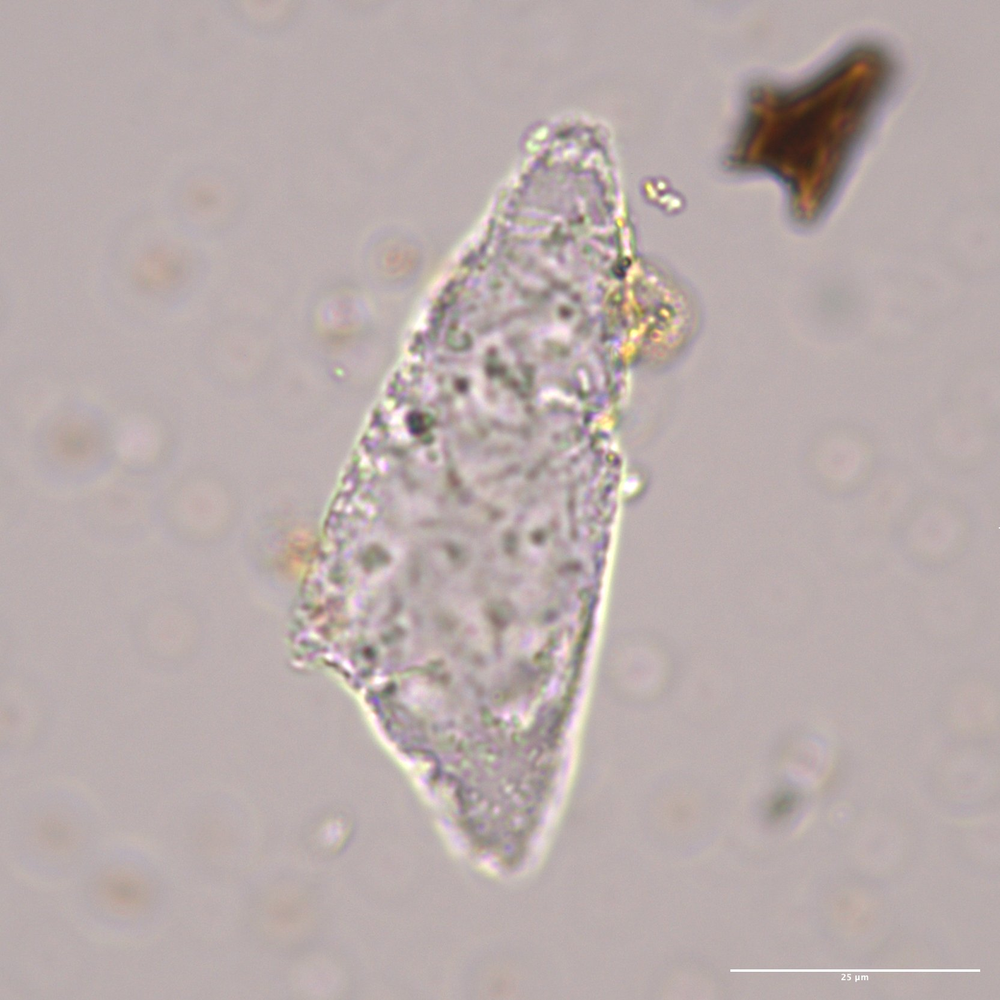
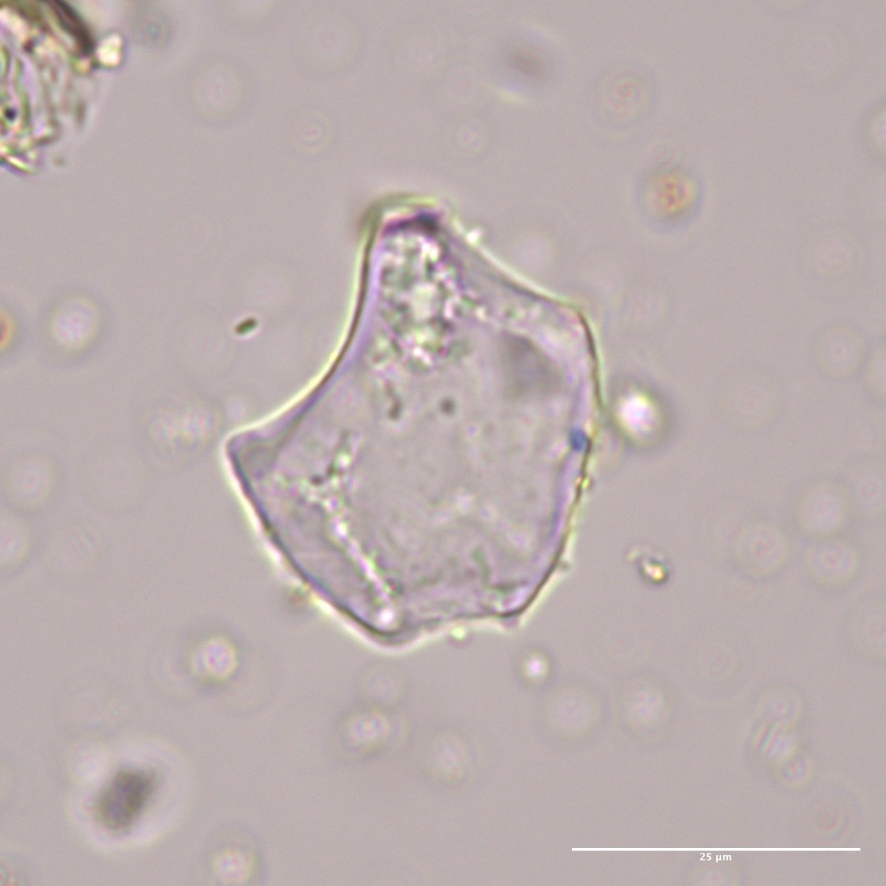
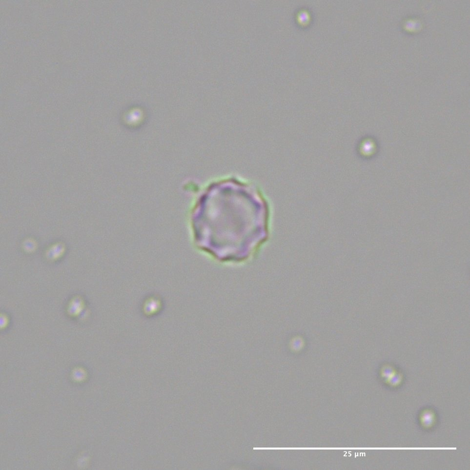
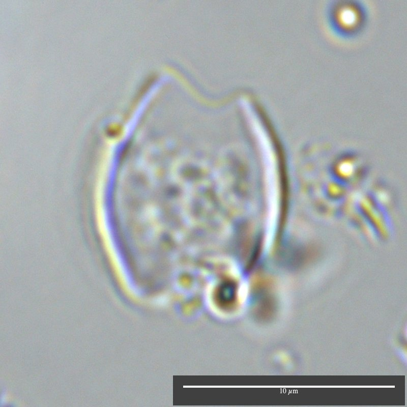
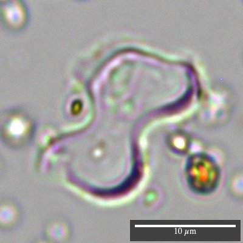
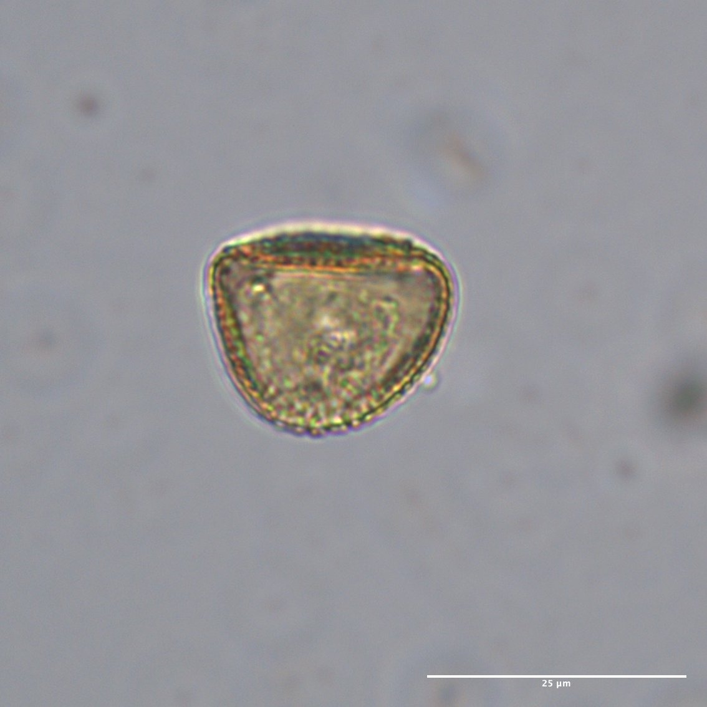
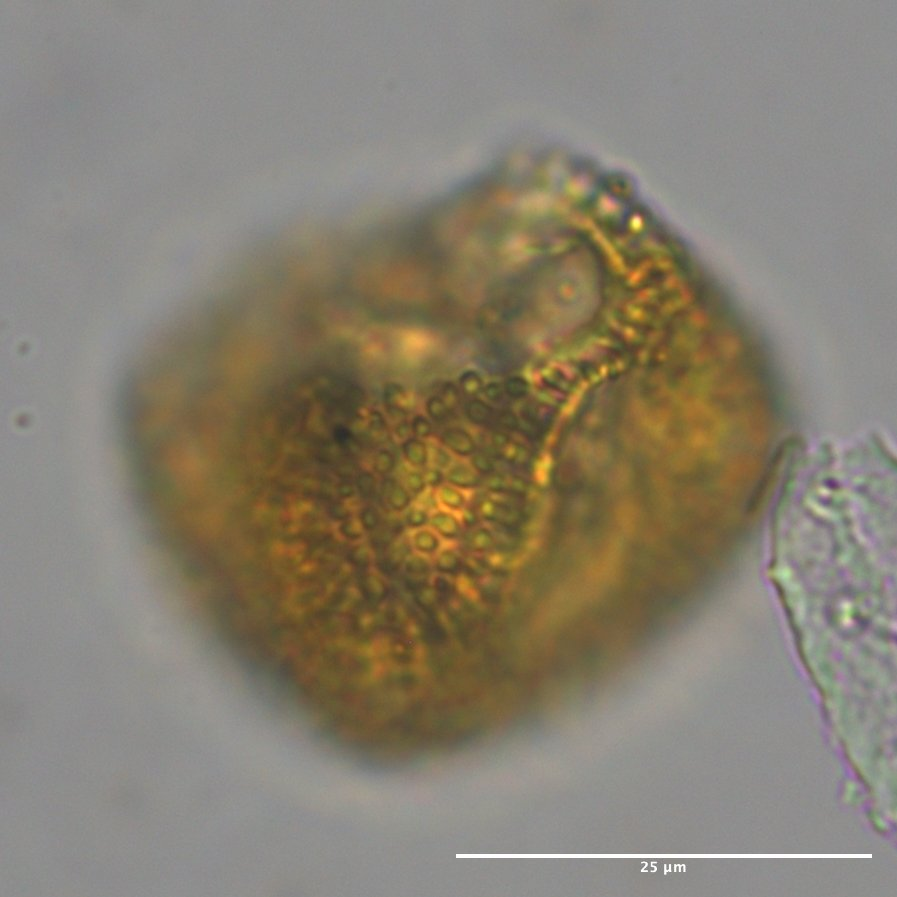

```{r setup, include=FALSE}
knitr::opts_chunk$set(echo = TRUE)

#Load libraries


library(vegan)
library(factoextra)
library(fpc)
library(cluster)
library(ellipse)
library(car)
library(MASS)
library(viridis)

#Load functions

zscore<-function(y1) {
  n1 <- mean(y1)
  n2 <- sd(y1)
  zscore <- (y1-n1)/n2
  zscore
}

sqchord_dist<-function(x,y){
  sqch_matrix<-matrix(ncol=nrow(y),nrow=nrow(x))
  for (j in 1:nrow(x)){
    sqch_results<-numeric(nrow(y))
    for (i in 1:nrow(y)){
      n1<-((x[j,]^0.5)-(y[i,]^0.5))^2
      sqch_results[i]<-sum(n1)
    }
    sqch_matrix[j,]<-sqch_results
  }
  return(sqch_matrix)
}

#Transparency Function
## Transparent colors
## Mark Gardener 2015
## www.dataanalytics.org.uk

t_col <- function(color, percent = 50, name = NULL) {
  #      color = color name
  #    percent = % transparency
  #       name = an optional name for the color
  
  ## Get RGB values for named color
  rgb.val <- col2rgb(color)
  
  ## Make new color using input color as base and alpha set by transparency
  t.col <- rgb(rgb.val[1], rgb.val[2], rgb.val[3],
               max = 255,
               alpha = (100 - percent) * 255 / 100,
               names = name)
  
  ## Save the color
  invisible(t.col)
}

#plottR function

plottR=function(x,y,
                percent=TRUE,
                spacing=5,
                min_LYCO=0,
                min_PHYT=0,
                min_POL=0,
                scale_exclude=FALSE,
                stacked=FALSE,
                set_windows=FALSE,
                window_size=100,
                stem_labels=NA,
                exclude_columns=NA,
                exclude_size=25,
                #exclude=NA, #Let's lose the "exclude" command, include "independent" plotting?
                plot_boxes=TRUE,
                box_width=5,
                by_depth=TRUE,
                record_name=NA,
                point_limit=5,
                log_concentrations=FALSE)
  { 
  taxa=colnames(x)
  
  if(percent==TRUE){ #Path for calculating percents rather than raw values ###CALCULATING PERCENTS IS STUPID
    
    #Scan for values to exclude
    LYCO_n=y$LYCO_n
    x=x[LYCO_n>min_LYCO,]
    
    all_sample_depths=y$depth
    cut_sample_depths=all_sample_depths[LYCO_n<=min_LYCO]
    use_sample_depths=all_sample_depths[LYCO_n>min_LYCO]
    
    #Need maximum widths of each type
    taxa=colnames(x)
    x_max=apply(x,2,max)
    
    if(scale_exclude==TRUE){ #We're dropping in spaces for the appended data
      x_max[(length(x_max)-(length(exclude_columns)-1)):length(x_max)]=exclude_size
    }
    
    windows=ceiling(x_max) #Each morphotype gets a "window" set just above its max value.
    
    anchors=vector("numeric",length=length(windows))
    for(i in 1:length(anchors)){
      if(i==1){
        anchors[i]=0
      } else {
        anchors[i]=sum(windows[1:(i-1)])+(spacing*(i-1))
      }
    }
    
    plot_width=sum(windows)+(spacing*(length(windows)-1)) #Total width for the plot in percent.
    
    if(by_depth==TRUE){ #Fork here to plot by date
      y_var=y$depth[LYCO_n>min_LYCO]
    } else {} #this is where you would add dates if applicable
    
    plot(0,0,xlim=c(0,plot_width),ylim=c(max(y_var)*-1,50),pch=NA,ann=FALSE,axes=FALSE) #Do we need divergent paths for plotting by date or depth?
    
    if(is.character(record_name)==TRUE){
      title(main=paste0(record_name," Results"))
    }
    
    text(anchors,5,labels=taxa,srt=45,adj=c(0,0),cex=0.8)
    
    axis(2,seq(max(y_var)*-1,0,5),las=1,labels=seq(max(y_var),0,-5))
    
    for(i in 1:ncol(x)){ #Loop for plotting data by columns, note that everything that's submitted gets plotted, "exclude" only refers to % calculation
      top_pts=c(rep(anchors[i],2))
      btm_pts=c(0,max(y_var)*-1)
      #print(c(top_pts,btm_pts)) #Testing if this was working, if there's problems, try turning this on.
      
      lines(top_pts,btm_pts)
      
      if(plot_boxes==TRUE){ #Splitting path here to focus on plotting boxes, can incorporate polygons later...
        if(scale_exclude==TRUE){
          if(i<ncol(x)-(length(exclude_columns)-1)){
            for(ii in 1:nrow(x)){
              if(x[ii,i]>point_limit){
                box_x=c(0,0,x[ii,i],x[ii,i])+anchors[i]
                box_y=c(y_var[ii],y_var[ii]+box_width,y_var[ii]+box_width,y_var[ii])*-1
                polygon(box_x,box_y,col="black")
              } else {
                pch_val=21
                pch_val[x[ii,i]==0]=NA
                points(x[ii,i]+anchors[i],(y_var[ii]+(box_width*0.5))*-1,pch=pch_val,bg="black",cex=0.5)
              }

            }
          } else {
            box_mx=max(x[,i],na.rm=TRUE)
            box_pr=x[,i]/box_mx
            box_points=box_pr*exclude_size
            for(ii in 1:nrow(x)){
              box_x=c(0,0,box_points[ii],box_points[ii])+anchors[i]
              box_y=c(y_var[ii],y_var[ii]+box_width,y_var[ii]+box_width,y_var[ii])*-1
              polygon(box_x,box_y,col="black")
            }
          }
        } else {
          for(ii in 1:nrow(x)){
            if(x[ii,i]>point_limit){
              box_x=c(0,0,x[ii,i],x[ii,i])+anchors[i]
              box_y=c(y_var[ii],y_var[ii]+box_width,y_var[ii]+box_width,y_var[ii])*-1
              polygon(box_x,box_y,col="black")
            } else {
              pch_val=21
              pch_val[x[ii,i]==0]=NA
              points(x[ii,i]+anchors[i],(y_var[ii]+(box_width*0.5))*-1,pch=pch_val,bg="black",cex=0.5)
            }

          }
        }

      } else {} #This is where we would do polygons
      
      if(i<ncol(x)-(length(exclude_columns)-1)){
        axis(1,at=c(anchors[i],anchors[i]+windows[i]),labels=c(0,windows[i]),cex.axis=0.5)
      } else {
        axis(1,at=c(anchors[i],anchors[i]+windows[i]),labels=c(0,ceiling(max(x[,i],na.rm=TRUE))),cex.axis=0.5)
      }
      
    } #Closing column plotting loop.
    
    points(-rep(spacing,length(use_sample_depths)),(use_sample_depths*-1)-(box_width*0.5),pch=21,cex=0.5)
    points(-rep(spacing,length(cut_sample_depths)),(cut_sample_depths*-1)-(box_width*0.5),pch=4,cex=0.5)
    
  } else { #Closing percent calculation path, this is where raw value plots would begin.
    
  #if(stacked==TRUE & summarize_taxa==TRUE){ #Building out loop to handle summarizing results by taxa groups.
    
    #We need summarized results for select samples (thresholds for sample size and lycopodium?), then we plot as points or boxes?
    
    
  #} #Closing out summarizing by group plots.
    
  if(stacked==TRUE & set_windows==TRUE){ #Opening section for plotting stacked results with even windows.
    
    if(log_concentrations==TRUE){
      conc_finder=grep("conc",colnames(x))
      for(i in 1:length(conc_finder)){
        x[,conc_finder[i]]=log(x[,conc_finder[i]])
      }
    }
    
    LYCO_n=y$LYCO_n
    
    all_sample_depths=y$depth
    cut_sample_depths=all_sample_depths[LYCO_n<=min_LYCO]
    use_sample_depths=all_sample_depths[LYCO_n>min_LYCO]
    
    x=x[LYCO_n>min_LYCO,]
    y=y[LYCO_n>min_LYCO,]
    taxa=colnames(x)
    x_max=apply(x,2,max)
    
    if(scale_exclude==TRUE){ #We're dropping in spaces for the appended data
      x_max[(length(x_max)-(length(exclude_columns)-1)):length(x_max)]=exclude_size
    }
    
    windows=rep(window_size,ncol(x)/2) #Each morphotype gets a "window" set just above its max value.
    
    anchors=vector("numeric",length=length(windows))
    for(i in 1:length(anchors)){
      if(i==1){
        anchors[i]=0
      } else {
        anchors[i]=sum(windows[1:(i-1)])+(spacing*(i-1))
      }
    }
    
    plot_width=sum(windows)+(spacing*(length(windows)-1)) #Total width for the plot in percent.
    
    if(by_depth==TRUE){ #Fork here to plot by date
      y_var=y$depth
    } else {} #this is where you would add dates if applicable
    
    plot(0,0,xlim=c(0,plot_width),ylim=c(max(y_var)*-1,50),pch=NA,ann=FALSE,axes=FALSE) #Do we need divergent paths for plotting by date or depth?
    
    if(is.character(record_name)==TRUE){
      title(main=paste0(record_name," Results"))
    }
    
    #Can we draw boxes straight out?
    
    evens=seq(2,ncol(x),2)
    odds=seq(1,ncol(x),2)
    
    plot_placement=vector("character",length=ncol(x))
    
    plot_placement[evens]="front"
    plot_placement[odds]="back"
    
    taxa=stem_labels
    
    anchors=rep(anchors,2)
    anchors=anchors[order(anchors)]
    
    text(anchors[evens]+(window_size*0.3),5,labels=taxa[evens],adj=c(0,0),cex=0.8) ###This is broken in stacked logic - FIX
    text(anchors[odds]+(window_size*0.3),15,labels=taxa[odds],adj=c(0,0),cex=0.8)
    axis(2,seq(max(y_var)*-1,0,5),las=1,labels=seq(max(y_var),0,-5))
    
    for(i in 1:ncol(x)){
      #print(c(top_pts,btm_pts)) #Testing if this was working, if there's problems, try turning this on.
      if(plot_boxes==TRUE){ #Splitting path here to focus on plotting boxes, can incorporate polygons later..
        if(plot_placement[i]=="front"){
          box_mx=max(x[,i-1],na.rm=TRUE)
          box_pr=x[,i]/box_mx
          box_points=box_pr*window_size
          for(ii in 1:nrow(x)){

            if(x[ii,i]>point_limit){
              
              box_x=c(0,0,box_points[ii],box_points[ii])+anchors[i]
              box_y=c(y_var[ii],y_var[ii]+box_width,y_var[ii]+box_width,y_var[ii])*-1
              polygon(box_x,box_y,col="gray")
              
            } else {
              pch_val=21
              pch_val[x[ii,i]==0]=NA
              points(x[ii,i]+anchors[i],(y_var[ii]+(box_width*0.5))*-1,pch=pch_val,bg="gray",cex=0.5)
              #points(x[ii,i]+anchors[i],(y_var[ii]+(box_width*0.5))*-1,pch=21,bg="gray",cex=0.5)
            }
            
          }
          
        } else { #"BACK" set of plots.
          box_mx=max(x[,i],na.rm=TRUE)
          box_pr=x[,i]/box_mx
          box_points=box_pr*window_size
          for(ii in 1:nrow(x)){
            
            if(x[ii,i]>point_limit){
              
              box_x=c(0,0,box_points[ii],box_points[ii])+anchors[i]
              box_y=c(y_var[ii],y_var[ii]+box_width,y_var[ii]+box_width,y_var[ii])*-1
              polygon(box_x,box_y,col="black")
              
            } else {
              pch_val=21
              pch_val[x[ii,i]==0]=NA
              points(x[ii,i]+anchors[i],(y_var[ii]+(box_width*0.5))*-1,pch=pch_val,bg="black",cex=0.5)
              #points(x[ii,i]+anchors[i],(y_var[ii]+(box_width*0.5))*-1,pch=21,bg="black",cex=0.5)
            }
              
          }
          
          labelbox_x=c(0,0,25,25)+anchors[i]
          labelbox_y1=c(5,5+box_width,5+box_width,5)
          labelbox_y2=c(15,15+box_width,15+box_width,15)
          
          polygon(labelbox_x,labelbox_y1,col="gray")
          polygon(labelbox_x,labelbox_y2,col="black")
          
          top_pts=c(rep(anchors[i],2))
          btm_pts=c(0,max(y_var)*-1)
          lines(top_pts,btm_pts)
          axis(1,at=c(anchors[i],anchors[i]+window_size),labels=c(0,ceiling(max(x[,i],na.rm=TRUE))),cex.axis=0.5)
          
        }
        
        #if(i<ncol(x)-(length(exclude_columns)-1)){
        #  axis(1,at=c(anchors[i],anchors[i]+windows[i]),labels=c(0,windows[i]),cex.axis=0.5)
        #} else {
        #  axis(1,at=c(anchors[i],anchors[i]+windows[i]),labels=c(0,ceiling(max(x[,i],na.rm=TRUE))),cex.axis=0.5)
        #}
        
      } else {} #This is where we would do polygons #Closing if/else for box plotting
    
    } #Closing Column loop
    
    points(-rep(spacing,length(use_sample_depths)),(use_sample_depths*-1)-(box_width*0.5),pch=21,cex=0.5)
    points(-rep(spacing,length(cut_sample_depths)),(cut_sample_depths*-1)-(box_width*0.5),pch=4,cex=0.5)
    
    } else {} #Closing loop for Stacked and Set Window == TRUE/FALSE

  } #Closing else loop for percent==TRUE
  
} #Closing out function

#Reading data and building array

minimum=c(100,10,NA) #Setting minimum sum for diagnostic fossils, with a higher threshold for Phytoliths than Pollen.
datasets=c("BG1_phytolith","BG1_pollen","Bremond_etal_2008")

Bargny_results=lapply(1:3,function(x){
  matrix()
})

Bargny_results=as.array(Bargny_results)

names(Bargny_results)=datasets

#Use loop to build array with results and major permutations.

for(i in 1:length(datasets)){
  if(i==3){
    Bremond_2008=read.csv(paste0(datasets[i],'.csv'),row.names="SAMPLE")
    DETAILS=Bremond_2008[,c('LAT','LON','AET.PET','ANN_PRECIP_mm','BIOCLIM')]
    ALL_PHYTOLITHS=Bremond_2008[,c(3:11,13)]
    DIAGNOSTIC_2005=Bremond_2008[,c('PAP','SPH_ECH','SPH_ORN','SPH_PSI','ACU_BUL','BUL_FLA','BIL','CRO','SAD')]
    INDICES_2005=Bremond_2008[,c('Iph.','Fs.','D.P')]
    PHYTOLITH_SUM=apply(DIAGNOSTIC_2005,1,sum)
    DETAILS=cbind(DETAILS,PHYTOLITH_SUM)
    PERCENT_2005=(DIAGNOSTIC_2005/PHYTOLITH_SUM)*100
    ZSCORE_PCT=apply(PERCENT_2005,2,zscore)
    Bargny_results[[i]]=array(list(DETAILS,ALL_PHYTOLITHS,DIAGNOSTIC_2005,INDICES_2005,PERCENT_2005,ZSCORE_PCT),dimnames=list(c("DETAILS","ALL_PHYTOLITHS","DIAGNOSTIC_2005","INDICES_2005","PERCENT_2005","ZSCORE")))
  } else {
    DATA=read.csv(paste0(datasets[i],'_data.csv'),row.names="SAMPLE")
    TAXA=read.csv(paste0(datasets[i],'_taxa.csv'))
    DETAILS=DATA[,TAXA[,3]=="CORE_DETAILS"]
    DIAGNOSTIC=DATA[,TAXA[,3]!="CORE_DETAILS"]
    DIAG_SUM=apply(DIAGNOSTIC,1,sum)
    #TOTAL=apply(DATA,1,sum)
    DETAILS=cbind(DETAILS,DIAG_SUM)
    SELECT=DIAGNOSTIC[DIAG_SUM>minimum[i],]
    SELECT_DETAILS=DETAILS[DIAG_SUM>minimum[i],]
    PERCENT_D=(SELECT/(apply(SELECT,1,sum)))*100
    ZSCORE_PD=apply(PERCENT_D,2,zscore)
    if(i==1){
      CONCENTRATION=(SELECT/SELECT_DETAILS$LYCO_n)*(SELECT_DETAILS$LYCO_Count/SELECT_DETAILS$wt_gm)
    } else {
      IND_NID=DETAILS[apply(DIAGNOSTIC,1,sum)>minimum[i],'IND_NID']
      SELECT=cbind(SELECT,IND_NID)
      CONCENTRATION=(SELECT/SELECT_DETAILS$LYCO_n)*(SELECT_DETAILS$LYCO_Count/SELECT_DETAILS$wt_gm)
    }
    Bargny_results[[i]]=array(list(DETAILS,SELECT_DETAILS,TAXA,DIAGNOSTIC,SELECT,PERCENT_D,CONCENTRATION,ZSCORE_PD),dimnames=list(c("DETAILS","SELECT_DETAILS","TAXA","DIAGNOSTIC","SELECT","PERCENT_D","CONCENTRATION","ZSCORE")))
  }
}


```


## Summary

This supplement describes the laboratory preparation, analysis, and quantitative analysis of plant microfossils recovered from the Bargny 1 deposits. 

## Laboratory methods

Sediment samples were ground, passed through a 250-micron sieve, and placed in a shaker overnight with Calgon solution (sodium hexametaphosphate) before having sands and clays separated by settling and centrifugation-decant cycles at 2500 rpm for 2 minutes. At this point, samples were spiked with Lycopodium spores and treated with 10% HCl in a 40º bath for 10 minutes. After centrifugation-decant cycles until pH neutral, the samples were separated by density using a solution of zinc bromide and 5% HCl with a specific gravity of 2.3 g/ml. The resulting residue was extracted in ethanol and transferred to glycerol for analysis.

This set of laboratory methods for extracting phytoliths employs standard steps for digesting terrestrial sediments and recovering plant microfossils, but omits the use of a strong oxidizing agent such as peroxide or nitric acid. Judging from the well-oxidized state of the sediments, futher degradation of the organic remains would only remove valuable information represented by organic microfossils (pollen microfossils, aeomebas, etc.), but also permits the use of Lycopodium spores to track laboratory errors and to calculate microfossil concentrations.


```{r sample weights and lycopodium batches,echo=FALSE}

knitr::kable(Bargny_results$BG1_phytolith$DETAILS[,c(1,2,5,6,7)],caption="**Table 1.** Samples, weights, tracer spores, diagnostic phytoliths, total phytoliths")


```


## Microfossil identificaiton

Phytolith and pollen microfossils were identified using a binocular light microscope at 400x-1000x. Phytolith nomenclature and categories follow the International Code for Phytolith Nomenclature (ICPT 2019), but we tried specifically to create sample categories consistent with Bremond et al.'s (2005, 2008) assessment of phytoliths from surface samples across West Africa (Table 2).

```{r phytolith types, echo=FALSE}

phytolith_classes=Bargny_results$BG1_phytolith$TAXA
phytolith_classes=phytolith_classes[is.na(phytolith_classes$Bremond_et_al_2005)==FALSE,]

knitr::kable(phytolith_classes,caption="**Table 2.** Phytolith classifications from ICPT (2019) compared to Bremond et al. (2005)")

```


## Microfossil Images

{width=30%}{width=30%} {width=30%} {width=30%} {width=30%} {width=30%} {width=30%}


## Plant Microfossil Recovery, Preservation, and Concentration

Phytolith frequencies were quantified by counting all phytoliths until a sample size of 200 diagnostic phytoliths was reached (see Bremond et al. 2005, 2008). Concentrations of phytoliths and pollen were established by tracking Lycopodium spores encountered during analysis. Samples where 200 Lycopodium were encountered before 50 identifiable phytoliths were considered unreliable. Although the number of diagnostic pollen sampled does reach 100 in some samples, the number of damaged, fragmented, and indeterminate types is too high to pursue reliable statistical reconstructions with the pollen data. In general, the patterns in microfossil deposition/preservation closely follow the site's sedimentology. 

```{r phytolith and pollen general results, cache=TRUE, fig.height=8,fig.width=12, echo=FALSE,fig.cap="**Figure 1.** Phytolith and Pollen Recovery and Preservation"}

#Goal is to look at all results, show what we're excluding, and then show concentrations on decent samples.

all_depths=Bargny_results$BG1_phytolith$DETAILS$depth
all_weight=Bargny_results$BG1_phytolith$DETAILS$wt_gm

phytolith_counts_all=cbind(Bargny_results$BG1_phytolith$DIAGNOSTIC,Bargny_results$BG1_phytolith$DETAILS$UNDIFF)
phytolith_counts_all=apply(phytolith_counts_all,1,sum)
phytolith_counts_dgn=apply(Bargny_results$BG1_phytolith$DIAGNOSTIC,1,sum)

pollen_counts_all=apply(cbind(Bargny_results$BG1_pollen$DIAGNOSTIC,Bargny_results$BG1_pollen$DETAILS$IND_NID),1,sum)
pollen_counts_dgn=apply(Bargny_results$BG1_pollen$DIAGNOSTIC,1,sum)

#Results from selected samples. - Not totally convince that this is worth doing right now...

select_depths=Bargny_results$BG1_phytolith$SELECT_DETAILS$depth

all_phy_conc=apply(Bargny_results$BG1_phytolith$CONCENTRATION,1,sum)
pol_conc=apply(Bargny_results$BG1_pollen$CONCENTRATION,1,sum)

#Organizing Lycopodium info to set up calculation of variance in sample results.

Lyco_batch=Bargny_results$BG1_phytolith$DETAILS$LYCO_Batch
Lyco_added=Bargny_results$BG1_phytolith$DETAILS$LYCO_Count
Lyco_n=Bargny_results$BG1_phytolith$DETAILS$LYCO_n
Lyco_var=vector("numeric",length=length(Lyco_added))
Lyco_var[Lyco_batch==140119321 | Lyco_batch==100320201]=2.62
Lyco_var[Lyco_batch==1031]=3.3

#Concentration Values

phytolith_conc_all=(phytolith_counts_all/Lyco_n)*(Lyco_added/all_weight)
phytolith_conc_dgn=(phytolith_counts_dgn/Lyco_n)*(Lyco_added/all_weight)

pollen_conc_all=(pollen_counts_all/Lyco_n)*(Lyco_added/all_weight)
pollen_conc_dgn=(pollen_counts_dgn/Lyco_n)*(Lyco_added/all_weight)

#Plotting tests

all_counts=cbind(phytolith_counts_all,phytolith_counts_dgn,pollen_counts_all,pollen_counts_dgn,phytolith_conc_all,phytolith_conc_dgn,pollen_conc_all,pollen_conc_dgn)
details=Bargny_results$BG1_phytolith$DETAILS

#plottR(all_counts,details,percent=TRUE,spacing=5,plot_boxes=TRUE,box_width=5,scale_exclude=TRUE,exclude_columns=c("phytolith_conc_dgn","pollen_conc_dgn"),exclude_size=30)

stem_labels=c("All Phytoliths","Diagnostic Phytoliths","All Pollen","Diagnostic Pollen","log Phytolith Conc.","log Diag. Phyt. Conc.","log Pollen Concentration","log Diag. Poll. Conc.")

plottR(all_counts,details,
       percent=FALSE,
       spacing=10,
       min_LYCO=1,
       scale_exclude=FALSE,
       stacked=TRUE,
       set_windows=TRUE,
       window_size=100,
       stem_labels=stem_labels,
       exclude_columns=NA,
       plot_boxes=TRUE,
       box_width=5,
       by_depth=TRUE,
       record_name="Bargny 1 Microfossil",
       point_limit=5,
       log_concentrations=TRUE)

```


## Phytolith Results

Phytoliths from the Bargny 1 samples show a strong representation of Chloridoideae and Panicoideae phytolith types (BIL and CRO, respectively) as well as types belonging to undifferentiated monocots (ACU_BUL, BUL_FLA, and RON). The frequency of SPH_ECH phytoliths is high in some of the lowermost samples, but we must use caution in interpreting this morphotype as it overlaps with sponge spicules common in coastal zones (ICPN 2009). While this type was tracked during analysis, this type is excluded from the statistical analyses. Samples with excessive SPH_PSI and SPH_ECH tend to be the most weathered and have the poorest preservation. These are excluded from futher analysis.

```{r phytolith results and concentrations, cache=TRUE,fig.height=8,fig.width=12, echo=FALSE,fig.cap="**Figure 2.** Phytolith results as a percent of the identifiable phytolith sum."}

data=Bargny_results$BG1_phytolith$DIAGNOSTIC
details=Bargny_results$BG1_phytolith$DETAILS
#phy_conc=apply(Bargny_results$BG1_phytolith$CONCENTRATION,1,sum)
CHAR=(Bargny_results$BG1_phytolith$DETAILS$CHARRED/Bargny_results$BG1_phytolith$DETAILS$DIAG_SUM)*100
TOTAL=apply(Bargny_results$BG1_phytolith$DIAGNOSTIC,1,sum)

data=cbind(data,CHAR,phytolith_conc_all,TOTAL)

plottR(data,
       details,
       spacing=15,
       min_LYCO=5,
       plot_boxes=TRUE,
       percent=TRUE,
       record_name="Bargny Phytolith Counts",
       scale_exclude=TRUE,
       exclude_columns=c("CHAR","ph_conc","TOTAL"),
       exclude_size=50)

```


## Pollen Results

Identifiable pollen was preserved in the samples and provides some insights into the kinds of vegetation cover that grew at the site during the major depositional phases. The lowermost samples are characterized by smaller pollen counts and low concentrations which steadily rise up to about 250 cm, where the samples yielded high pollen counts and a greater concentration of pollen. For much of the middle section of the deposits, the pollen are often damaged and although identified types are high, these tend to be types that are easily distinguished (Poaceae/Amaranthaceae). There's a modest improvement in pollen preservation/concentration between 60-90 cm as well. What we do see in these samples are examples of types introduced by trade-wind activity (Olea-type & Pinus), riparian/estuarine trees/shrubs (Avicennia, Syzygium), and regional Sudanian woodland pollen types (Acacia, Celtis, Trema).

```{r pollen results, cache=TRUE,fig.height=8,fig.width=12, echo=FALSE,fig.cap="**Figure 3.** Pollen results as a percent of the identifiable phytolith sum."}

data=Bargny_results$BG1_pollen$DIAGNOSTIC
details=Bargny_results$BG1_phytolith$DETAILS
#pol_conc=apply(Bargny_results$BG1_pollen$CONCENTRATION,1,sum)
TOTAL_POLLEN=apply(Bargny_results$BG1_pollen$DIAGNOSTIC,1,sum)
IND_NID=Bargny_results$BG1_pollen$DETAILS$IND_NID

data=cbind(data,IND_NID,pollen_conc_all,TOTAL_POLLEN)

plottR(data,
       details,
       spacing=15,
       min_LYCO=5,
       plot_boxes=TRUE,
       percent=TRUE,
       record_name="Bargny Pollen Counts",
       scale_exclude=TRUE,
       exclude_columns=c("pol_conc","TOTAL_POLLEN"),
       exclude_size=50)

```


## Summary Plots by Plant Type

```{r summarizing results by type, cache=TRUE,fig.height=8,fig.width=12, echo=FALSE,fig.cap="**Figure 4.** Phytolith and pollen percent by vegetation type."}

par(mfrow=c(1,2))

taxa=Bargny_results$BG1_phytolith$TAXA[Bargny_results$BG1_phytolith$TAXA$GROUP!="CORE_DETAILS",]
taxa_groups=unique(taxa$GROUP[taxa$GROUP!="CORE_DETAILS"])
taxa_sums=matrix(nrow=nrow(Bargny_results$BG1_phytolith$SELECT),ncol=length(taxa_groups))
for(i in 1:length(taxa_groups)){
  grabber=grep(paste0(taxa_groups[i]),taxa$GROUP)
  if(length(grabber)>1){
    taxa_sums[,i]=apply(Bargny_results$BG1_phytolith$SELECT[,grabber],1,sum)
  } else {
    taxa_sums[,i]=Bargny_results$BG1_phytolith$SELECT[,grabber]
  }
}

taxa_sums=as.data.frame(taxa_sums)
colnames(taxa_sums)=taxa_groups
row.names(taxa_sums)=row.names(Bargny_results$BG1_phytolith$SELECT_DETAILS)
taxa_pct=(taxa_sums/Bargny_results$BG1_phytolith$SELECT_DETAILS$DIAG_SUM)*100
taxa_details=Bargny_results$BG1_phytolith$SELECT_DETAILS

phytolith_pct=taxa_pct
phytolith_dtl=taxa_details

plottR(taxa_pct,
       taxa_details,
       spacing=15,
       min_LYCO=5,
       plot_boxes=TRUE,
       percent=TRUE,
       record_name="Bargny Phytoliths By Taxonomic Affiliation",
       scale_exclude=FALSE,
       exclude_columns=NA,
       exclude_size=50)

taxa=Bargny_results$BG1_pollen$TAXA[Bargny_results$BG1_pollen$TAXA$GROUP!="CORE_DETAILS",]
taxa_groups=unique(taxa$GROUP[taxa$GROUP!="CORE_DETAILS"])
taxa_sums=matrix(nrow=nrow(Bargny_results$BG1_pollen$SELECT),ncol=length(taxa_groups))
for(i in 1:length(taxa_groups)){
  grabber=grep(paste0(taxa_groups[i]),taxa$GROUP)
  if(length(grabber)>1){
    taxa_sums[,i]=apply(Bargny_results$BG1_pollen$SELECT[,grabber],1,sum)
  } else {
    taxa_sums[,i]=Bargny_results$BG1_pollen$SELECT[,grabber]
  }
}

taxa_sums=as.data.frame(taxa_sums)
colnames(taxa_sums)=taxa_groups
row.names(taxa_sums)=row.names(Bargny_results$BG1_pollen$SELECT_DETAILS)
taxa_pct=(taxa_sums/Bargny_results$BG1_pollen$SELECT_DETAILS$DIAG_SUM)*100
taxa_details=Bargny_results$BG1_pollen$SELECT_DETAILS

pollen_pct=taxa_pct
pollen_dtl=taxa_details

plottR(taxa_pct,
       taxa_details,
       spacing=15,
       min_LYCO=5,
       plot_boxes=TRUE,
       percent=TRUE,
       record_name="Bargny Pollen Frequencies by Vegetation Type ",
       scale_exclude=FALSE,
       exclude_columns=NA,
       exclude_size=50)

par(mfrow=c(1,1))

```


## Quantitative Comparisons with Surface Samples

Studies of surface soil phytoliths conducted by Bremond and colleagues (2005, 2008) provide an important resource for evaluating archaeological phytolith aseemblages. We use Principal Component Analysis and Minimum Square-Chord Distances to compare the phytolith spectra and to gain insights into the range of environments represented at Bargny 1. PCA was chosen because of the "predict" functionality in R, which is not available for other types of factor analysis (constrained correspondence, etc.). To look for changes in rainfall or the boundaries of major vegetation zones, we applied MSCD to establish the most similar sets of modern samples and plot their relevant climatic (rainfall) or geographic (latitude) representation across the depositional sequence.

```{r Bremond comparisons, cache=TRUE, fig.height=8,fig.width=12, echo=FALSE,fig.cap="**Figure 6.** PCA of modern soil sample (Bremond et al. 2005; 2008 - left) and Bargny 1 results plotted using the same eigenvalues."}

#Reading modern phytolith data and zscore permutation

Bremond=Bargny_results$Bremond_etal_2008$DIAGNOSTIC_2005
#Bremond=Bremond[,-c(1:4)]
Bremond_details=Bargny_results$Bremond_etal_2008$DETAILS
#Bremond_zscore=Bargny_results$Bremond_etal_2008$ZSCORE
Bremond_taxa=colnames(Bremond)

#Read Bargny 1 data and match columns. Handle BLO - BUL-FLA overlap in this section.

Bargny_1=Bargny_results$BG1_phytolith$SELECT
#Bargny_zscore=Bargny_results$BG1_phytolith$ZSCORE
Bargny_details=Bargny_results$BG1_phytolith$SELECT_DETAILS

Bargny_matchedpct=matrix(nrow=nrow(Bargny_1),ncol=length(Bremond_taxa))
Bargny_matchedpct=as.data.frame(Bargny_matchedpct)
colnames(Bargny_matchedpct)=Bremond_taxa
row.names(Bargny_matchedpct)=row.names(Bargny_1)

Bargny_column_sorter=vector("character" , length = ncol(Bargny_1))

for(i in 1:ncol(Bargny_matchedpct)){
  column_find=grep(Bremond_taxa[i],colnames(Bargny_1))
  if(Bremond_taxa[i]=="BUL_FLA"){
    staple=grep("BLO",colnames(Bargny_1))
    column_find=c(column_find,staple)
  }
  Bargny_column_sorter[column_find]=Bremond_taxa[i]
  if(length(column_find)>1){
    Bargny_match=apply(Bargny_1[,Bargny_column_sorter==Bremond_taxa[i]],1,sum)
  } else {
    Bargny_match=Bargny_1[,Bargny_column_sorter==Bremond_taxa[i]]
  }
  Bargny_matchedpct[,i]=Bargny_match
}

#Make percents and zscores.

Bremond_pct=(Bremond/apply(Bremond,1,sum))*100
Bargny_matchedpct=(Bargny_matchedpct/apply(Bargny_matchedpct,1,sum))*100

Bremond_zscore=apply(Bremond_pct,1,zscore)
Bargny_zscore=apply(Bargny_matchedpct,1,zscore)

#Make PCA model - need to decide if we would rather have Detrended correspondence analysis...

Brm_PCApct=princomp(Bremond_pct)
Brm_PCAz=princomp(t(Bremond_zscore))

combined_pct=predict(Brm_PCApct,Bargny_matchedpct)
combined_z=predict(Brm_PCAz,t(Bargny_zscore))

#I want ellipses around the data points showing limits of strata vs. vegetation types.

#Brm_Kmean=kmeans(t(Bremond_zscore),4,nstart=25)

#Make color and symbol schemes. Bargny data needs to be colored by Stratum, Bremond needs to combine biome assignment and precipitation.

latitude_max=ceiling(max(Bremond_details$LAT))
latitude_min=floor(min(Bremond_details$LAT))

palette(heat.colors(120))
pch_modern=vector("numeric",length=nrow(Bremond_pct))
pch_modern[Bremond_details$BIOCLIM=="SAHARAN"]=22
pch_modern[Bremond_details$BIOCLIM=="SAHELIAN"]=23
pch_modern[Bremond_details$BIOCLIM=="SUDANIAN"]=24
pch_modern[Bremond_details$BIOCLIM=="GUINEAN"]=25

#Set color palette

#library(wesanderson)
#palette(wes_palette('GrandBudapest1',100,type="continuous"))
col_base=terrain.colors(40)
SAHARA_col=col_base[35]
SAHEL_col=col_base[30]
SUDAN_col=col_base[20]
GUINEA_col=col_base[10]

#Make transparency/set colors

SAHARA_col=t_col(SAHARA_col,perc=70,name="SAHARA.col")
SAHEL_col=t_col(SAHEL_col,perc=70,name="SAHEL.col")
SUDAN_col=t_col(SUDAN_col,perc=70,name="SUDAN.col")
GUINEA_col=t_col(GUINEA_col,perc=70,name="GUINEA.col")

bioclimate_colors=c(SAHARA_col,SAHEL_col,SUDAN_col,GUINEA_col)

stratum=Bargny_details$stratum
strat_names=unique(stratum)
strat_colors=vector("numeric",length=length(stratum))
strat_base=viridis::viridis(60)
for(i in 1:length(strat_names)){
  strat_colors[stratum==strat_names[i]]=strat_base[i*10]
}

#Plotting zone, needs a serious clean up.

#plot(Brm_PCApct$scores[,1],Brm_PCApct$scores[,2],pch=pch_modern,bg=(latitude_max-Bremond_details$LAT),main="PCA results for soil Phytolith %")
#points(combined_pct[,1],combined_pct[,2],pch=21,bg="blue")


#This will draw an ellipse, but it can't be filled with a color (BOOOOOOO)

#dataEllipse(Brm_PCAz$scores[,1],Brm_PCAz$scores[,2],add=TRUE,col="red",plot.points = FALSE)
#plot(0,0,pch=NA,xlim=c(-4,2),ylim=c(-2,5))
#But we can crack it open and use the information and draw a polygon, which is a cheap solution.
  #Is there a method to calculate all the ellipses at once?
ellipse_SAHEL=dataEllipse(Brm_PCAz$scores[Bremond_details$BIOCLIM=="SAHELIAN",1],
                          Brm_PCAz$scores[Bremond_details$BIOCLIM=="SAHELIAN",2],
                          plot.points=FALSE,levels=c(0.65,0.95),fill=TRUE,col="orange",fill.alpha=0.1,draw=FALSE)

ellipse_SUDAN=dataEllipse(Brm_PCAz$scores[Bremond_details$BIOCLIM=="SUDANIAN",1],
                          Brm_PCAz$scores[Bremond_details$BIOCLIM=="SUDANIAN",2],
                          plot.points=FALSE,levels=c(0.65,0.95),fill=TRUE,col="yellow",fill.alpha=0.1,draw=FALSE)

ellipse_SAHAR=dataEllipse(Brm_PCAz$scores[Bremond_details$BIOCLIM=="SAHARAN",1],
                          Brm_PCAz$scores[Bremond_details$BIOCLIM=="SAHARAN",2],
                          plot.points=FALSE,levels=c(0.65,0.95),fill=TRUE,col="red",fill.alpha=0.1,draw=FALSE)

ellipse_GUINE=dataEllipse(Brm_PCAz$scores[Bremond_details$BIOCLIM=="GUINEAN",1],
                          Brm_PCAz$scores[Bremond_details$BIOCLIM=="GUINEAN",2],
                          plot.points=FALSE,levels=c(0.65,0.95),fill=TRUE,col="green",fill.alpha=0.1,draw=FALSE)

ellipse_result1SD=array(data=c(ellipse_SAHAR[1],ellipse_SAHEL[1],ellipse_SUDAN[1]))
ellipse_result2SD=array(data=c(ellipse_SAHAR[2],ellipse_SAHEL[2],ellipse_SUDAN[2]))

par(mfrow=c(1,2))

plot(Brm_PCAz$scores[,1],
     Brm_PCAz$scores[,2],
     pch=pch_modern,
     bg=Bremond_details$ANN_PRECIP_mm/10,
     main="PCA results for soil Phytolith z-scores",
     xlab="Component 1 (57%)",
     ylab="Component 2 (25%)")
for(i in 1:length(ellipse_result1SD)){
  polygon(ellipse_result2SD[[i]][,1],ellipse_result2SD[[i]][,2],col=bioclimate_colors[i],lty=3)
  polygon(ellipse_result1SD[[i]][,1],ellipse_result1SD[[i]][,2],col=bioclimate_colors[i],lty=2)
}
#points(combined_z[,1],combined_z[,2],pch=21,bg="blue")
points(Brm_PCAz$scores[,1],Brm_PCAz$scores[,2],pch=pch_modern,bg=Bremond_details$ANN_PRECIP_mm/10)
#text(Brm_PCAz$scores[,1],Brm_PCAz$scores[,2]+0.1,labels=row.names(Bremond_pct),cex=0.75)
legend(-2.5,3,legend=c(unique(Bremond_details$BIOCLIM)),pch=c(22,23,24,25), pt.bg=unique(bioclimate_colors))


plot(0,0,pch=NA,xlim=c(-3,2),ylim=c(-1,4),xlab="Component 1",ylab="Component 2")

#This might be the winner, define colors and calculate ellipses...
for(i in 1:length(ellipse_result1SD)){
  polygon(ellipse_result2SD[[i]][,1],ellipse_result2SD[[i]][,2],col=bioclimate_colors[i],lty=3)
  polygon(ellipse_result1SD[[i]][,1],ellipse_result1SD[[i]][,2],col=bioclimate_colors[i],lty=2)
}
#points(Brm_PCAz$scores[,1],Brm_PCAz$scores[,2],pch=pch_modern,bg=(latitude_max-Bremond_details$LAT))
points(combined_z[,1],combined_z[,2],pch=21,bg=strat_colors)
#text(Brm_PCAz$scores[,1],Brm_PCAz$scores[,2]+0.1,labels=row.names(Bremond_pct),cex=0.5)
text(combined_z[,1],combined_z[,2]+0.1,labels=Bargny_details$stratum,cex=0.75)
title(main="Bargny 1 z-Scores Plotted with Surface Loadings")
legend(-2.5,3,legend=strat_names,pch=21,pt.bg=c(unique(strat_colors)))

par(mfrow=c(1,1))

```


PCA shows the influence of rainfall on Bremond et al.s (2005, 2008) phytolith spectra. However, the individual vegetation zones are only generally resolved using these vectors. Ellipses (65% and 95%) drawn around the important vegetation types near Bargny (Sahelian, Sudanian, and Saharan) to show the degree of overlap. The archaeological samples, when plotting using the eigenvectors from the original PCA, show a tight clusering with positive values on component 1 and low scores on component 2. Most of the samples fall within the 95% ellipse for Sahelian woodlands, but stratum 3 and 1 both yielded more negative component 1 loadings, indicating drier conditions.

```{r square-chord distances, echo=false, cache=TRUE, fig.height=8,fig.width=12, echo=FALSE,fig.cap="**Figure 7.** Plots comparing Bargny samples with surface samples (Bremond et al. 2005) using square-chord distances of scaled (z-score) diagnostic phytolith results. The five best matches are plotted by their current precipitation regime per sampled depth."}

palette(heat.colors(60))

precip=Bremond_details$ANN_PRECIP_mm[order(Bremond_details$ANN_PRECIP_mm)]
latitude=Bremond_details$LAT[order(Bremond_details$LAT)]

Bremond_pct=Bremond_pct[order(precip),]
Bremond_samples=row.names(Bremond)
Bremond_names=Bremond_samples[order(precip)]

mscd_results=sqchord_dist(Bremond_pct,Bargny_matchedpct)

#mscd_results=mscd_results[,order(colnames(mscd_results),decreasing = TRUE)]

row.names(mscd_results)=row.names(Bremond_pct)
colnames(mscd_results)=row.names(Bargny_matchedpct)

mod_match=apply(mscd_results,2,min)
match_names=Bremond_names
n_matches=5

#mscd_results=mscd_results[,Phyt_total>100]
depth=Bargny_details$depth
#depth=depth[Phyt_total>100]

par(mfrow=c(1,2))

for(i in 1:ncol(mscd_results)){
  if(i==1){
    plot(0,0,pch=NA,xlim=c(0,1300),ylim=c(max(depth)*-1,0),axes=FALSE,ann=FALSE)
    axis(1,at=seq(0,1000,100))
    axis(2,at=depth*-1,labels=colnames(mscd_results),tick=FALSE,las=1,line=-1)
    best_vect=vector("numeric",length=ncol(mscd_results))
    title(main="Square-Chord Distance Comparison With Bremond et al. (2005, 2008)")
    title(xlab="Annual Precipitation in mm")
  }
  
  n=Bremond_names[order(mscd_results[,i])]
  min_n=min(mscd_results[order(mscd_results[,i]),i])
  max_n=max(mscd_results[order(mscd_results[,i]),i])
  n1=n[1] #Sample name that's the mscd match
  p=precip[order(mscd_results[,i])]
  p1=p[1:n_matches] #best matches
  x=precip[mscd_results[,i]<50]
  x1=precip[Bremond_names==paste0(n1)]
  r=mscd_results[order(mscd_results[,i]),i]
  r1=r[1:n_matches] #best matches
  
  points(p1,rep(depth[i]*-1,length(p1)),pch=21,bg=r1,col="black",cex=(1-(r1/max_n))*3)
  #points(x1,i,pch=22,cex=1.2)
  best_vect[i]=x1
  
  if(i==ncol(mscd_results)){
    lines(best_vect,depth*-1,type="o",lty=1,pch=21,bg="black")
    #legend(900,-20,
    #       legend=c("Strong Similarity","Weak Similarity","Best Match"),
    #       pch=21,pt.bg=c(10,50,"black"),
    #       pt.cex=c(0.9*3,0.3*3,1),
    #       lty=c(NA,NA,3)
    #       )
  }
  
}

#Trying this by latitude.

Bremond_pct=Bremond_pct[order(latitude),]
Bremond_samples=row.names(Bremond)
Bremond_names=Bremond_samples[order(latitude)]

mscd_results=sqchord_dist(Bremond_pct,Bargny_matchedpct)

#mscd_results=mscd_results[,order(colnames(mscd_results),decreasing = TRUE)]

row.names(mscd_results)=row.names(Bremond_pct)
colnames(mscd_results)=row.names(Bargny_matchedpct)

mod_match=apply(mscd_results,2,min)
match_names=Bremond_names

#mscd_results=mscd_results[,Phyt_total>100]
depth=Bargny_details$depth
#depth=depth[Phyt_total>100]
#xaxe_labels=c("Annual Precipitation in mm","Latitude")

for(i in 1:ncol(mscd_results)){
  if(i==1){
    plot(0,0,pch=NA,xlim=c(min(latitude),max(latitude)),ylim=c(max(depth)*-1,0),axes=FALSE,ann=FALSE)
    axis(1,at=seq(floor(min(latitude)),ceiling(max(latitude)),1))
    axis(2,at=depth*-1,labels=colnames(mscd_results),tick=FALSE,las=1,line=-1)
    best_vect=vector("numeric",length=ncol(mscd_results))
    title(main="Square-Chord Distance Comparison With Bremond et al. (2005, 2008)")
    title(xlab="Latitude in Degrees N")
  }
  
  n=Bremond_names[order(mscd_results[,i])]
  min_n=min(mscd_results[order(mscd_results[,i]),i])
  max_n=max(mscd_results[order(mscd_results[,i]),i])
  n1=n[1] #Sample name that's the mscd match
  p=latitude[order(mscd_results[,i])]
  p1=p[1:n_matches] #best 25 matches
  x=latitude[mscd_results[,i]<50]
  x1=latitude[Bremond_names==paste0(n1)]
  r=mscd_results[order(mscd_results[,i]),i]
  r1=r[1:n_matches] #best 25 matches
  
  points(p1,rep(depth[i]*-1,length(p1)),pch=21,bg=r1,col="black",cex=(1-(r1/max_n))*3)
  #points(x1,i,pch=22,cex=1.2)
  best_vect[i]=x1
  
  if(i==ncol(mscd_results)){
    lines(best_vect,depth*-1,type="o",lty=1,pch=21,bg="black")
    legend(17,-20,
           legend=c("Strong Similarity","Weak Similarity","Best Match"),
           pch=21,pt.bg=c(10,50,"black"),
           pt.cex=c(0.9*3,0.3*3,1),
           lty=c(NA,NA,3)
           )
  }
  
}

par(mfrow=c(1,1))

```


## Phytolith Indices for Savanna Types and Grass Stress

We can also compare the values for indices used by Bremond et al. (2005, 2008) to evaluate aridity/savanna type (Iph) and grass water stress (Fs). These values do a good job of discriminating the boundaries between the Sudanian and Guinean zones (Iph values) and the Sahelian and Saharan zones (Fs). These values allow us to look for potential turnover betwen major vegetation formations.

```{r Phytolith indices, echo=FALSE, fig.height=8, fig.width=12, fig.cap="**Figure 4.** Comparison of long vs. short grass savanna index (Iph, x-axis) and Fan-shaped index (Fs, y-axis) results for Bargny samples (green and blue squares) with Bremond et al.'s (2005) results from West African surface samples", eval=TRUE}

lump_BLO=TRUE

data=Bargny_results$BG1_phytolith$SELECT

if(lump_BLO==TRUE){
  data[,'BUL_FLA']=data[,'BUL_FLA']+data[,'BLO']
}

phyt_groups=Bargny_results$BG1_phytolith$TAXA$GROUP[Bargny_results$BG1_phytolith$TAXA$GROUP!="CORE_DETAILS"]

GR_sum=apply(data[phyt_groups=="GRASSES"|phyt_groups=="GRASSES_PANICOID"|phyt_groups=="GRASSES_CHLORIDOID"|names(data)=="BUL_FLA"],1,sum)
ChPa_sum=apply(data[phyt_groups=="GRASSES_PANICOID"|phyt_groups=="GRASSES_CHLORIDOID"],1,sum)

BG1_Fs=(data$BUL_FLA/GR_sum)*100
BG1_Iph=(data$SAD/apply(data[,c('BIL','CRO','SAD')],1,sum))*100

Bargny_results$BG1_phytolith$SELECT_DETAILS=cbind(Bargny_results$BG1_phytolith$SELECT_DETAILS,BG1_Fs,BG1_Iph)

mFs=Bargny_results$Bremond_etal_2008$INDICES_2005$Fs.
mIph=Bargny_results$Bremond_etal_2008$INDICES_2005$Iph.

palette(heat.colors(ceiling(max(Bargny_results$Bremond_etal_2008$DETAILS$ANN_PRECIP_mm)/10)))
point_colors=point_colors=Bargny_results$Bremond_etal_2008$DETAILS$ANN_PRECIP_mm/10
conc_colors=vector("character",length=nrow(phytolith_pct))
conc_colors[Bargny_results$BG1_phytolith$DETAILS$DIAG_SUM>100]="green"
conc_colors[Bargny_results$BG1_phytolith$DETAILS$DIAG_SUM<100]="blue"

plot(mIph,mFs,xlim=c(0,100),pch=21,bg=point_colors)
points(BG1_Iph,BG1_Fs,pch=22,bg=conc_colors)
lines(c(20,20),c(0,55),lty=3)
legend(80,20,c("high precip","low precip",">100 Identifications","<100 Identifications"),pch=c(21,21,22,22),pt.bg=c(129,1,"green","blue"))
text(BG1_Iph,BG1_Fs,labels=row.names(phytolith_pct),adj=1.2)
title(main="Bargny1 Phytolith Results: Comparing Fst and Iph Indices with Bremond et al. (2005)")

```


## Synthetic Results

To create some insights into the scale and direction of past vegetation change represented in the Bargny 1 deposits, we plot the results for four different indices, grouping their results by stratum (Figure 6.). The indices include Fs, Iph, Grass-Amaranthaceae pollen, and wetland/riparian/mangrove pollen. As expected, the Grass/Amaranthaceae ratio is not especially informative, but the other indices show a clear turnover after stratum 4, when the depositonal environment shifts from near-coastal estuarine conditions to halophytic dry coastal plain.

```{r boxplots by stratum, echo=FALSE, fig.height=8, fig.width=12, fig.cap="**Figure 6.** Boxplots of Phytolith indices and grouped pollen results by stratum."}

stratum=Bargny_results$BG1_phytolith$SELECT_DETAILS$stratum

#stratum=vector("character",length=nrow(BG1))
strat_names=c("I","II","III","IV","V","VI")
strat_depths=c(0,38,100,220,250,318)
strat_widths=vector("numeric",length=length(strat_depths))

for(i in 1:length(strat_depths)){
  #stratum[BG1$depth>=strat_depths[i] & BG1$depth<=strat_depths[i+1]]=paste0(strat_names[i])
  strat_widths[i]=strat_depths[i+1]-strat_depths[i]
  if(i==6){
    #stratum[BG1$depth>=strat_depths[i]]=paste0(strat_names[i])
    strat_widths[i]=360-strat_depths[i]
  }

}

#Can we do this by pollen type?

grass_pollen=pollen_pct$GRASSES
xeric_scrub=pollen_pct$XERIC
Sudaeo_Guinean=pollen_pct$`SUDANEO-GUINEAN_TREES-SHRUBS`
riparian_trees=pollen_pct$`RIPARIAN_TREES-SHRUBS`
wetland_herbs=pollen_pct$WETLAND_HERBS
estuarine_signal=riparian_trees+wetland_herbs
stratum=pollen_dtl$stratum
strat_mid=(strat_depths+(strat_widths*0.5))*-1

gx_index=log(grass_pollen/xeric_scrub)

#Cleanup on low concentrations.

BG1_Fs=Bargny_results$BG1_phytolith$SELECT_DETAILS$BG1_Fs
BG1_Iph=Bargny_results$BG1_phytolith$SELECT_DETAILS$BG1_Iph
#BG1_Ppct=BG1_Ppct[Phyt_total>100,]
#depth=BG1$depth
#depth=depth[Phyt_total>100]
#stratum=stratum[Phyt_total>100]
Gr_CHAM=grass_pollen/xeric_scrub
depth=Bargny_results$BG1_pollen$SELECT_DETAILS$depth
#depth=depth[Phyt_total>100]
#Boxplot with results

par(mfrow=c(1,4))

#BG1_Fs=log(BG1_Fs)

plot(0,0,xlim=c(min(BG1_Fs,na.rm=TRUE),max(BG1_Fs,na.rm=TRUE)),ylim=c(max(depth)*-1,15),pch=NA,axes=FALSE,ann=FALSE)
boxplot(BG1_Fs~stratum,horizontal=TRUE,at=strat_mid,boxwex=strat_widths,outline=FALSE,add=TRUE)
lines(BG1_Fs,depth*-1,pch=21,bg="red",type="o",lty=3)
axis(4,at=seq(0,360,50)*-1)
title(xlab="log of Grass Stress Index Fs")
arrows(min(BG1_Fs,na.rm=TRUE),5,max(BG1_Fs,na.rm=TRUE),5,code=3,length=0.1)
text(min(BG1_Fs,na.rm=TRUE)+(0.25*(max(BG1_Fs,na.rm=TRUE))),15,"Less Arid",cex=0.8)
text(max(BG1_Fs,na.rm=TRUE)-(0.25*(max(BG1_Fs,na.rm=TRUE))),15,"More Arid",cex=0.8)

plot(0,0,xlim=c(min(BG1_Iph,na.rm=TRUE),max(BG1_Iph,na.rm=TRUE)),ylim=c(max(depth)*-1,15),pch=NA,axes=FALSE,ann=FALSE)
boxplot(BG1_Iph~stratum,horizontal=TRUE,at=strat_mid,boxwex=strat_widths,outline=FALSE,add=TRUE)
lines(BG1_Iph,depth*-1,pch=21,bg="red",type="o",lty=3)
title(xlab="Short vs. Long Grass Index Iph")
arrows(min(BG1_Iph,na.rm=TRUE),5,max(BG1_Iph,na.rm=TRUE),5,code=3,length=0.1)
text(min(BG1_Iph,na.rm=TRUE)+(0.15*(max(BG1_Iph,na.rm=TRUE))),15,"Long-Grass",cex=0.8)
text(max(BG1_Iph,na.rm=TRUE)-(0.15*(max(BG1_Iph,na.rm=TRUE))),15,"Short Grass",cex=0.8)

###

plot(0,0,xlim=c(min(gx_index,na.rm=TRUE),max(gx_index,na.rm=TRUE)),ylim=c(max(depth)*-1,15),pch=NA,axes=FALSE,ann=FALSE)
boxplot(gx_index~stratum,horizontal=TRUE,at=strat_mid,boxwex=strat_widths,outline=FALSE,add=TRUE)
lines(gx_index,depth*-1,pch=21,bg="orange",type="o",lty=3)
axis(4,at=seq(0,360,50)*-1)
title(xlab="log ratio of Grasses to Xeric Scrub")
arrows(min(gx_index,na.rm=TRUE),5,max(gx_index,na.rm=TRUE),5,code=3,length=0.1)
text(min(gx_index,na.rm=TRUE)+(0.40*(max(gx_index,na.rm=TRUE))),15,"Xeric Scrub",cex=0.8)
text(max(gx_index,na.rm=TRUE)-(0.40*(max(gx_index,na.rm=TRUE))),15,"Grassland",cex=0.8)


plot(0,0,xlim=c(0,max(estuarine_signal,na.rm=TRUE)),ylim=c(max(depth)*-1,15),pch=NA,axes=FALSE,ann=FALSE)
boxplot(estuarine_signal~stratum,horizontal=TRUE,at=strat_mid,boxwex=strat_widths,outline=FALSE,add=TRUE)
lines(estuarine_signal,depth*-1,pch=21,bg="dark green",type="o",lty=3)
axis(4,at=seq(0,360,50)*-1)
title(xlab="Wetland Herbs, Mangroves, and Riparian Trees")
arrows(min(estuarine_signal,na.rm=TRUE),5,max(estuarine_signal,na.rm=TRUE),5,code=3,length=0.1)
text(min(estuarine_signal,na.rm=TRUE)+(0.25*(max(estuarine_signal,na.rm=TRUE))),15,"Less",cex=0.8)
text(max(estuarine_signal,na.rm=TRUE)-(0.25*(max(estuarine_signal,na.rm=TRUE))),15,"More",cex=0.8)

par(mfrow=c(1,1))

```


We further synthesize the results by plotting the Fs, Iph, and estuarine indices by stratum showing both the distribution of sample results (points) and their collective behavior (kernel density plots/color scheme). 

```{r kernel densities by stratum, echo=FALSE, fig.height=8, fig.width=12, fig.cap="**Figure 7.** Synthetic results showing wetland, water stress, and precipitation proxies with kernel density plots for each stratum"}

spacer=0.5

s_indices=array(list(BG1_Fs,BG1_Iph,estuarine_signal),dimnames=list(c("BG1_Fs","BG1_Iph","estuarine_signal")))

select_phyconc=phytolith_conc_all[phytolith_counts_dgn>100]
select_polconc=pollen_conc_dgn[phytolith_counts_dgn>100]

select_phyconc[Bargny_results$BG1_phytolith$SELECT_DETAILS$LYCO_n<4]=min(select_phyconc) #BG1.355 did not yield sufficient Lycopodium, so it is being assigned the lowest-confidence concentration value
select_polconc[Bargny_results$BG1_phytolith$SELECT_DETAILS$LYCO_n<4]=min(select_polconc)

c_indices=array(list(select_phyconc,select_phyconc,select_polconc),
                dimnames=list(c("Phytolith Concentration 1","Phytolith Concentration 2","Pollen Concentration")))

est_labels=c("Less","More")
Iph_labels=c("Tall Grass","Short Grass")
Fst_labels=c("Low Stress","High Stress")

label_array=array(list(Fst_labels,Iph_labels,est_labels),dimnames=(list(c("Fst Labels","Iph Labels","Estuary Labels"))))

est_colors=rev(viridis(100))
Fst_colors=rev(plasma(100))
Iph_colors=rev(plasma(100))

color_array=array(list(Fst_colors,Iph_colors,est_colors),dimnames=list(c("Fst Colors","Iph Colors","Est Colors")))

par(mar=c(5, 4, 4, 5) + 0.1)

plot(0,0,xlim=c(0,380),ylim=c(0,length(s_indices)+(spacer*(length(s_indices)))),pch=NA,axes=FALSE,ann=FALSE)
axis(1,at=1:18*20)
title(xlab="depth cm")

for(m in 2:length(strat_depths)){
  text(strat_mid[m]*-1,4.1,strat_names[m])
  lines(c(rep(strat_depths[m],2)),c(0,length(s_indices)+(spacer*(length(s_indices)))),lty=3)
}

for(m in 1:length(s_indices)){
  axis(2,at=c(m-1,m)+spacer*(m-1),labels=c(0,1),las=1,cex.axis=0.75)
  axis(4,at=c(m-1,m)+spacer*(m-1),labels=c(paste0(label_array[[m]])),las=1,cex.axis=0.5)
  concentration=c_indices[[m]]
  lines(c(-10,380),c(rep((m-1)+spacer*(m-1),2)),lwd=0.75)
  lines(c(-10,380),c(rep((m)+spacer*(m-1),2)),lwd=0.75)
  
  palette(color_array[[m]])
  
  for(i in 2:length(strat_mid)){
    
    proxy=as.numeric(s_indices[[m]])
    
    
    d=density(proxy[stratum==strat_names[i]])
    x_density=d$y
    x_scaled=x_density/max(d$y)
    y_range=d$x #Not cutting zeros anymore.
    y_scaled=y_range/max(proxy) 
    
    y_scaled=y_scaled+((m-1)+spacer*(m-1))
    
    box_y=seq((m-1)+(spacer*(m-1)),m+(spacer*(m-1)),0.05)
    
    box_lft=rep(strat_depths[i],length(box_y)) #Box building is making boxes for entire interval and only filling some of them. Could clean this up.
    box_rgt=rep(strat_depths[i]+strat_widths[i],length(box_y))
    
    box_colors=vector("numeric",length=length(box_y))
    
    for(k in 1:(length(box_y)-1)){
      if(box_y[k]<max(y_scaled)){
        box_colors[k]=mean(x_scaled[y_scaled>box_y[k] & y_scaled<box_y[k+1]])*100
      }
    }
    
    for(j in 1:length(box_y)-1){
      polygon(c(box_lft[j:(j+1)],rev(box_rgt[j:(j+1)])),c(box_y[j:(j+1)],rev(box_y[j:(j+1)])),col=box_colors[j],border=NA)
    }
    
    polygon((x_scaled*-10)+(-1*(strat_mid[i])+(0.5*(strat_widths[i]))),y_scaled,col=SUDAN_col)
    points(depth[stratum==strat_names[i]],
          (proxy[stratum==strat_names[i]]/max(proxy)+((m-1)+(spacer*(m-1)))),
          pch=21,bg=SUDAN_col,lty=3,cex=1+concentration[stratum==strat_names[i]]/max(concentration))
  }
}

par(mar=c(5, 4, 4, 2) + 0.1)

```

